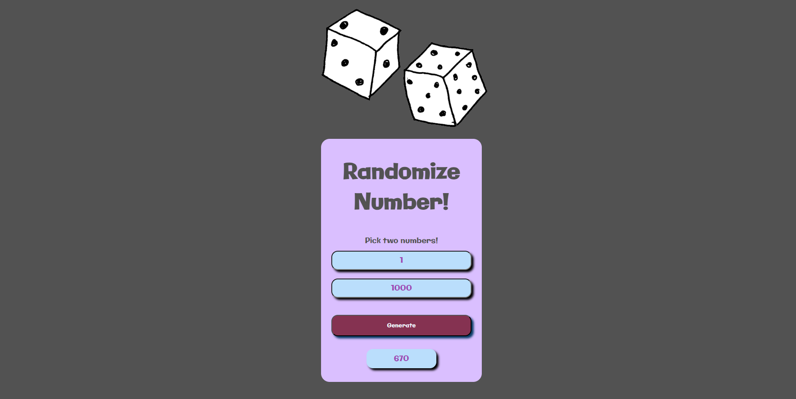

# Project-Randomizer

"Randomizer" is a straightforward web application that generates random numbers within a user-specified range. Created using HTML, CSS, and JavaScript, this project provides a convenient tool for generating random numbers for various purposes.

## Features

- Generates random numbers between two user-defined values.
- User-friendly interface for setting the number range.
- HTML and CSS used for structure and styling.
- JavaScript powers the random number generation.

## Technologies Used

- 
- 
- 

## Preview

[Link to Live Demo](https://jhschier.github.io/Project-Randomizer/)

## About

The "Randomizer" project offers a quick and efficient solution for generating random numbers within a specified range. Its user-friendly interface makes it easy to set the range and receive random numbers instantly.
